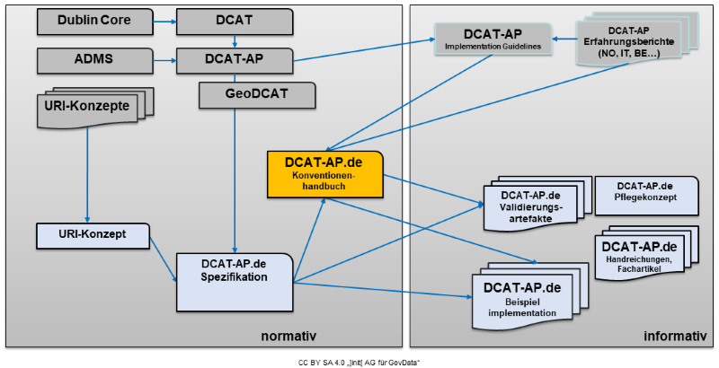

# Struktur und Elemente von DCAT-AP
Um die Grundlagen des DCAT-AP-Schemas zu verstehen, ist es wichtig, sich zunächst mit den zentralen Konzepten vertraut zu machen, auf denen es basiert. Ein wesentlicher Ursprung liegt in der *Dublin Core Metadata Workshop Series*, die 1995 ins Leben gerufen wurde. Diese Workshops brachten Fachleute aus verschiedenen Bereichen zusammen – darunter Bibliothekar*innen, Forschende im Bereich digitaler Bibliotheken sowie Experten für Inhalte und Textverarbeitung. Ihr gemeinsames Ziel war es, Standards zu entwickeln, die die Auffindbarkeit elektronischer Ressourcen verbessern {cite}`Weibel1998RFC2413`.

*Dublin Core* ist heute ein Schlüsselstandard im Umgang mit Metadaten. Da Metadaten die Grundlage für die Organisation und Verknüpfung von Informationen im Web bilden, ermöglicht dieser Standard, Inhalte und Dienste miteinander zu verbinden und sie für Benutzer zugänglicher zu machen. Die *Dublin Core Metadata Initiative (DCMI)* hat dazu beigetragen, ein flexibles Framework zu schaffen, das die Entwicklung von Metadatenformaten erleichtert und interdisziplinäre Entdeckungsmöglichkeiten fördert. Das Ergebnis ist ein Kernstandard, der mittlerweile in 25 Sprachen übersetzt wurde und bis heute eine wichtige Rolle bei der Strukturierung und Auffindbarkeit von Informationen spielt {cite}`WeibelKoch2000DublinCore`.

Der *Dublin-Core-Metadatenstandard* wurde entwickelt, um Interoperabilität im Kontext des Semantic Web und vernetzter Daten (Linked Data) zu ermöglichen. 

Einfacher gesagt: Dublin Core™(*warum wird das Trademarkzeichen erst hier verwendet und nicht schon früher?)* verwendet spezielle Web-Adressen, sogenannte URIs (Uniform Resource Identifiers) um deutlich zu machen, worauf sich die Metadaten beziehen  – sowohl für die Objekte, die in den Metadaten beschrieben werden, als auch für die Begriffe, die in den genutzten Vokabularen vorkommen. Eine besondere Stärke von Dublin Core™ ist das sogenannte Anwendungsprofil (Application Profile, AP). Es beschreibt, wie die grundlegenden Prinzipien und Begriffe von Dublin Core™ angepasst oder mit spezialisierten Vokabularen kombiniert werden können, um den spezifischen Anforderungen einzelner Projekte oder Anwendungsfälle gerecht zu werden. {cite}`DCMI_Metadata_Basics`.

Im Grunde genommen beinhaltet der Dublin Core™ Information über 15 breit verwendete Elemente - Urheber, Mitwirkender, Herausgeber, Titel, Datum, Sprache, Format, Thema, Beschreibung, Kennung, Bezug, Quelle, Typ, Abdeckung und Rechte. Dieses Set wurde zum ersten Mal auf einem Treffen im Jahr 1995 in Dublin, Ohio definiert{cite}`DublinCore`. Mainstream-Entwickler haben Vokabulare wie Dublin Core™ verwendet und nutzen sie weiterhin im Kontext von relationalen Datenbanken und Repositorien, von denen viele auf Extensible Markup Language (XML) basieren – einer erweiterbaren Auszeichnungssprache zur Festlegung der Inhalte von Metadatensätzen als strukturierte Dokumente. Darüber hinaus wird die intuitive Bündelung von Beschreibungen in Sets ermöglicht. Beschreibungen mehrerer Ressourcen, wie „Buch“ oder „Autor“, können in einem Beschreibungsset zusammengefasst werden, das entweder direkt als RDF-Graph gespeichert oder in einem Format codiert wird, das in RDF umgewandelt werden kann.  Ein gut gestaltetes Anwendungsprofil basiert auf verfügbaren RDF-Vokabularen, klar definierten Entitätsmodellen und explizit formulierten funktionalen Anforderungen. Die Konsolidierung des Dublin Core als Standard ist eine graduelle Entwicklung, die sich über einen Zeitraum von 20 Jahren erstreckt hat {cite}`arakaki2018dublin`. Zusammenfassend lässt sich sagen, dass der Dublin Core™ als Schlüssel für die Erstellung von Metadaten und die Unterstützung bei der Gestaltung von Abfragen dient, um diese effektiv auffindbar zu machen. Für diese Abfragen wird eine spezifische Abfragesprache verwendet – ein Thema, mit dem wir uns im folgenden Kapitel 5 befassen werden.

Mit dem Wissen über den Dublin Core™ betrachten wir nun das Data Catalog Vocabulary (DCAT). DCAT ist ein RDF-Vokabular, das auf dem Dublin-Core™-Benennungsschema basiert. Sein Zweck besteht darin, die Interoperabilität zwischen Datenkatalogen im Web zu ermöglichen. DCAT wurde im Kontext von staatlichen Datenkatalogen wie [data.gov](https://data.gov/) und [data.gov.uk](https://www.data.gov.uk/) entwickelt {cite}`W3C_DCAT_v3`. DCAT wird durch das World Web Consortium (W3C) verwaltet. Mit anderen Worten, DCAT ist ein vertrauenwürdiges und institutionalisiertes Projekt, das auf politischer Ebene unterstützt und als staatliche Initiative gefördert wird. Dazu gehören spezifische *Anwendungsprofile*, die in verschiedenen Ländern für Metadateninfrastrukturen entwickelt wurden. Ein Beispiel dafür ist *DCAT-AP.de*, dessen Bezeichnung sich auf diese Weise erklären lässt.

In Deutschland nutzen verschiedene staatliche Datenportale wie GovData und die Datenportale der Bundesländer (z. B. das Transparenzportal Hamburg) DCAT-AP.de zur Standardisierung von Metadaten. Dies ermöglicht eine konsistente Katalogisierung von Daten und vereinfacht die Datenveröffentlichung und -nutzung, sowohl innerhalb der öffentlichen Verwaltung als auch für Bürger*innen.

Durch die Anlehnung an den europäischen DCAT-AP-Standard ermöglicht DCAT-AP.de eine reibungslose Zusammenarbeit und Datenintegration mit dem Europäischen Datenportal. Deutsche Datensätze, die mit DCAT-AP.de beschrieben sind, lassen sich so problemlos auf das Europäische Datenportal übertragen, was eine einheitliche und grenzübergreifende Datennutzung innerhalb der EU fördert{cite}`CKAN_DCAT_AP`.
