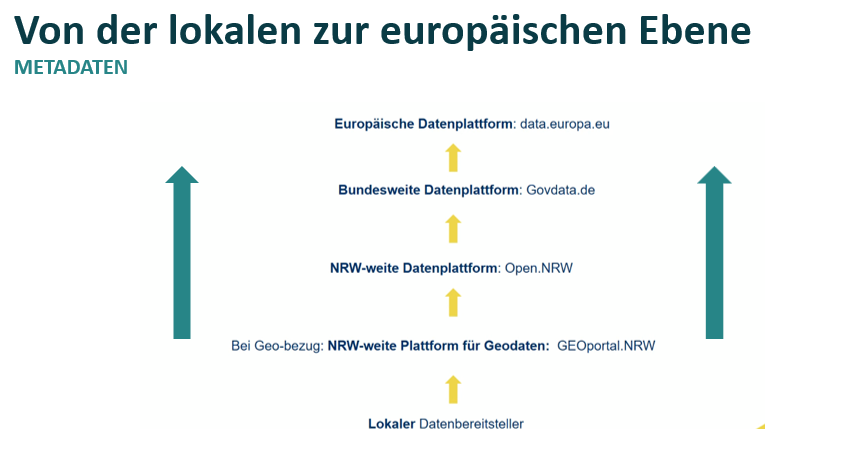

# Datenbasis: Metadatenportal
Im Rahmen dieser Fallstudie befassen wir uns mit der systematischen Abfrage und Nutzung von Metadaten, wie sie über das deutsche Metadatenportal GovData.de bereitgestellt werden. Dieses Portal bietet eine gute Gelegenheit, sich mit der Datenstruktur von Datenportalen auf verschiedenen Ebenen vertraut zu machen – lokal, national und europäisch – und zu verstehen, wie Metadaten über diese Ebenen hinweg abgerufen und verarbeitet werden können.

Datensätze werden zunächst von Datenbereitstellern auf lokaler Ebene erfasst, etwa durch Kommunen oder Landesbehörden. Diese lokalen Datensätze werden anschließend auf landesweiten Plattformen aggregiert. Um den überregionalen Wissensaustausch zu ermöglichen, fließen die Daten aus den einzelnen Landesportalen in das bundesweite Portal GovData.de ein.

Im Rahmen der europäischen Datenintegration werden diese nationalen Daten schließlich auf der Plattform data.europa.eu bereitgestellt. Dadurch entsteht eine mehrstufige Dateninfrastruktur, die es ermöglicht, Metadaten auf verschiedenen Ebenen gezielt zu suchen, zu filtern und für Forschungszwecke zu nutzen.

*Abbildung 1: Quelle - Open.NRW
