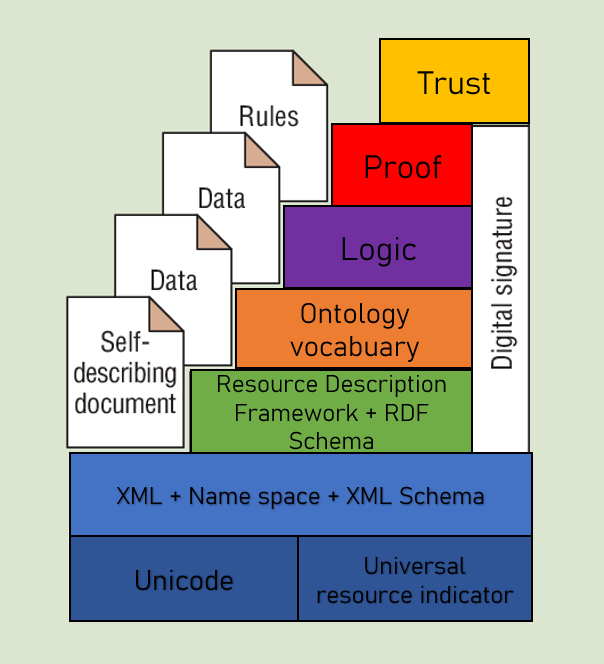

# "Layer cake" Architektur

*Abbildung 3: Der Semantic Web Layer Cake* Bildquelle: {cite}`Hendler2001`

Die obenstehende Grafik stellt die geschichtete Architektur (Layer Cake) des Semantic Web dar. Sie besteht aus verschiedenen Technologien und Konzepten, die miteinander interagieren und aufeinander aufbauen, um das Framework von strukturierten Daten und deren zugrunde liegenden Bezügen zu unterstützen.
Wir erklären nun stufenweise jede Schicht und beginnen bei der untersten:
1. Unicode & URI (Universal Resource Indicator) - Unicode als Basis stellt sicher, dass der gesamte Text konsistent durch eine globale Codierung aller Zeichen repräsentiert wird. URI dient als Standardidentifikator für alle Ressourcen im Web.
2. XML, Namespace, & XML Schema - eXtensible Markup Language (XML) ist ein flexibles Textformat für die Datenstrukturierung. Es dient als Datenvermittlungswerkzeug. Namespaces helfen dabei, Namenskonflikte durch die Identifizierung von Vokabularen zu vermeiden. XML-Schemata definieren die Struktur und Datentypen von XML-Dokumenten, indem sie entsprechende Regeln festlegen.
3. RDF (Resource Description Framework) & RDF Schema - die bereits oben erklärten Konzepte werden integriert, um Informationen über Datenressourcen strukturiert darzustellen.
4. Ontology & Vocabulary - die Ontologie bietet eine Möglichkeit, strukturierte Vokabulare zu definieren, die Beziehungen und Kategorien in einem bestimmten Bereich beschreiben (z. B. „Eine Katze ist ein Tier“). Diese Schicht ist entscheidend, um es Maschinen zu ermöglichen, die Beziehungen zwischen verschiedenen Datenpunkten zu verstehen und dadurch Schlussfolgerungen sowie logische Ableitungen zu unterstützen. Das Vokabular bezieht sich auf spezifische Begriffe und Konzepte, die verwendet werden, um Entitäten und ihre Beziehungen innerhalb eines Wissensbereichs zu beschreiben.
5. Logik - die Logik ermöglicht automatisierte Entscheidungsprozesse auf Grundlage strukturierter Daten.
6. Proof - die Prüfschicht stellt die Validität der Ergebnisse sicher, indem sie die Schritte überprüft, die zu einer Schlussfolgerung führen.
7. Trust - die oberste Schicht der Architektur bezieht sich auf die Etablierung der Vertrauenwürdigkeit der Daten durch Authentifizierungsmechanismen und die Überprüfung der Zuverlässigkeit der Datenquellen. 
Ein wichtiger Bestandteil, der über mehrere Schichten hinweg wirkt, ist die digitale Signatur. Diese Technologie stellt die Datenintegrität sicher und ermöglicht die Überprüfung, wer die Daten erstellt hat.

Das Konzept von verlinkten Daten, oder *Linked Data*, ist essenziell für die vollständige Umsetzung einer erfolgreichen Semantic-Web-Struktur. In unserer vorherigen Fallstudie zur Reproduzierbarkeit von Datenanalysen haben wir uns genau mit diesem Konzept auseinandergesetzt - [Weitere Informationen finden Sie hier](https://quadriga-dk.github.io/Tabelle-Fallstudie-1/Markdown/16_Linked-Data.html).
